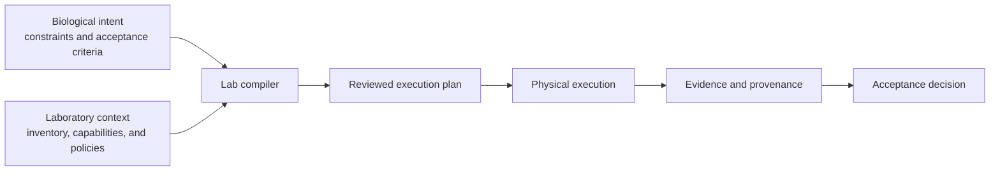

# Lab Strategy

## Thesis

**Lab is a compiler for portable biological work.**

Scientists describe the biological result they want, the constraints that must hold, and the evidence needed to accept it. Lab compiles that intent into a reviewable plan for a particular laboratory.

One biological program should be adaptable to different valid laboratories without losing its meaning or hiding the choices made for each site.

## Problem

Laboratory procedures commonly mix scientific intent, method selection, material assumptions, operator steps, and device commands. That makes work difficult to transfer, inspect, and adapt. Device-specific automation often preserves the same coupling in code.

Lab separates what should be made, observed, or demonstrated from how a particular laboratory can accomplish it.

## Model

## Strategic choices

- Specify biological intent, constraints, and acceptance evidence before site-specific procedure.
- Treat laboratory automation as compilation through explicit, inspectable stages.
- Model biological designs, physical materials, actions, provenance, and evidence as first-class concepts.
- Specialize late against declared inventory, policies, capabilities, and instruments.
- Give Python and the Lab Language one semantic model and one compiler boundary.
- Execute the reviewed artifact and relate resulting evidence back to the original acceptance criteria.

Portability does not mean that every laboratory can execute every program. A target must satisfy the program's requirements, and unsupported work should fail clearly before execution.

## Non-goals

Lab is not a vendor-specific robot API, a replacement for every LIMS or ELN, or a general robotics framework. It may integrate with those systems through explicit contracts.

Lab does not choose biological goals, conceal laboratory-specific decisions, bypass human review, or treat simulation as qualification of physical work.

## Long-term result

Lab succeeds when scientists can:

- Express the same biological work in Python or the Lab Language.
- Compile it for materially different laboratories without changing its scientific meaning.
- Inspect the methods, materials, resources, and target assumptions selected during compilation.
- Execute the reviewed plan and preserve evidence and provenance from intent through outcome.

## Where details live

[SIG charters](GROUPS.md#special-interest-groups) define technical responsibilities. [Working Groups](GROUPS.md#working-groups) coordinate bounded cross-SIG outcomes. Source repositories and GitHub Projects hold implementation status, validation evidence, and delivery plans.
